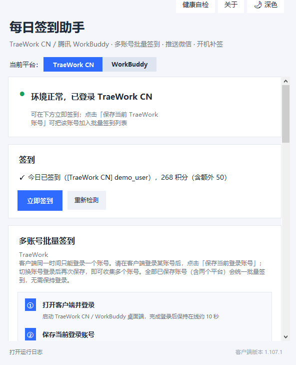
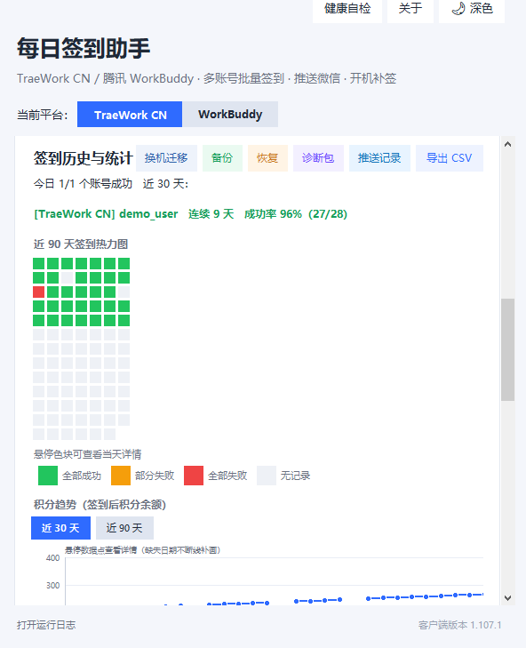

# TraeWork 签到助手

[](https://www.python.org/)
[](#)
[](LICENSE)
[](#)

> TraeWork CN / 腾讯 WorkBuddy 每日自动签到桌面工具。多账号批量签到、结果微信推送、90 天历史统计、掉线预警与健康自检，纯 Python 标准库实现，Windows 10/11 双击即用。

---

## 目录

- [功能特性](#功能特性)
- [截图](#截图)
- [环境要求](#环境要求)
- [快速开始](#快速开始)
- [使用说明](#使用说明)
- [项目结构](#项目结构)
- [数据与隐私](#数据与隐私)
- [从源码运行](#从源码运行)
- [打包发布](#打包发布)
- [测试](#测试)
- [常见问题](#常见问题)
- [免责声明](#免责声明)
- [License](#license)

---

## 功能特性

- **双平台支持**：同时管理 TraeWork CN（TRAE SOLO CN）与腾讯 WorkBuddy（CodeBuddy 桌面端）账号。
- **多账号批量签到**：登录凭证经 Windows DPAPI 加密保存为本地快照，签到时直接调用官方接口，无需客户端保持登录；账号可随时停用 / 启用、设置备注名。
- **每日自动签到**：通过 Windows 计划任务在设定时刻静默执行，随机延后 0–5 分钟；关机错过会在开机后自动补跑，同一天重复触发不会重复签到或推送；任务确认要执行时先推送一条「开始签到」通知（每日至多一条，到点与补签统一覆盖）。
- **失败自动重试**：网络超时 / DNS / 限流（429）/ 服务端临时错误自动退避重试；批量签到只重试仍失败的账号，登录失效类失败给出一键重登引导。
- **结果多渠道推送**：支持 Server酱、PushPlus、企业微信群机器人、钉钉群机器人；可设置仅失败时推送；自动发送周报 / 月报。
- **历史与统计**：保留近 90 天记录，提供连续天数、成功率、月度统计、14 天明细、90 天热力日历、30/90 天积分趋势折线图，可导出 Excel 兼容 CSV。
- **掉线预警**：账号连续签到失败达到阈值（默认 3 次）自动重点提醒，并区分“登录掉线”与“普通故障”。
- **防假成功校验**：服务器返回成功但查不到积分变化时，结果标记“待人工确认”，防止官方接口改版导致误报。
- **健康自检中心**：一键检查客户端安装、网络连通、账号快照、凭据时效、推送配置与计划任务状态，异常项直接给出处理建议。
- **备份 / 恢复 / 诊断包**：一键备份全部本地数据、跨机迁移向导、导出严格脱敏的诊断包（密钥与凭证绝不明文外发）。
- **崩溃兜底**：主线程 / 后台线程 / Tk 回调异常自动转存到 `crashes/`（最多 10 份），下次启动提示处理。
- **浅色 / 深色主题**：一键切换并记住偏好。
- **零第三方运行时依赖**：仅使用 Python 标准库（含 tkinter）。

## 截图

主界面：环境状态、签到结果、多账号管理与自动签到设置。



签到历史与统计：连续天数、成功率、90 天热力日历与积分趋势。



## 环境要求

- Windows 10 / 11（64 位）
- 已安装 TraeWork CN 或腾讯 WorkBuddy 客户端，并至少登录过一次
- 普通用户权限即可（无需管理员）
- 从源码运行需 Python 3.10+（Windows 官方安装包默认包含 tkinter）

## 快速开始

### 方式一：直接使用发布版（推荐普通用户）

1. 到仓库的 Releases 页面下载最新的 `TraeWorkCheckin.exe`（绿色单文件）或安装包。
2. 双击运行。若出现“Windows 已保护你的电脑”，点击“更多信息 → 仍要运行”（程序未购买收费数字代码签名）。
3. 窗口顶部选择平台，状态显示“已登录”后点击“立即签到”。
4. 在“每日自动签到”区域设置时间并开启，之后每天自动后台签到。

### 方式二：从源码运行（适合开发者）

```powershell
git clone https://github.com/<your-name>/traework-checkin-assistant.git
cd traework-checkin-assistant
python -m trae_checkin
```

命令行查看今日签到状态：

```powershell
python -m trae_checkin --status
```

手动触发一次静默批量签到（等价于计划任务执行）：

```powershell
python -m trae_checkin --silent
```

## 使用说明

### 添加多个账号

两个客户端同一时刻只能登录一个账号，本工具通过“凭证快照”实现批量：

1. 在客户端登录账号 A，打开本工具确认状态为“已登录”。
2. 点击“保存当前 TraeWork / WorkBuddy 账号”，列表出现该账号。
3. 在客户端切换登录账号 B，等待自动识别后再次保存。
4. 点击“全部账号签到”即可对所有已保存账号（两个平台一起）签到。

快照凭证使用 Windows DPAPI 加密，绑定当前电脑与当前 Windows 账户，复制到其他机器无法解密，明文不会写入磁盘。

### 配置微信推送

推荐使用 [Server酱](https://sct.ftqq.com)（免费版每日 5 条）：

1. 微信扫码登录 sct.ftqq.com 并关注“方糖”服务号。
2. 复制以 `SCT` 开头的 SendKey。
3. 在程序“签到结果推送到微信”区域勾选开启、选择渠道、粘贴 Key 并保存。
4. 点击“发送测试消息”验证。

备选：PushPlus、企业微信群机器人、钉钉群机器人（后两者的机器人安全关键词需设置为“签到”）。

更完整的图文说明见 [使用指南](docs/usage.md)。

## 项目结构

```text
traework-checkin-assistant/
├── trae_checkin/              # 主包
│   ├── __init__.py
│   ├── __main__.py            # python -m trae_checkin 入口
│   ├── cli.py                 # 命令行参数解析（--silent / --status）
│   ├── constants.py           # 全局常量：URL、平台标识、安装目录名等
│   ├── runtime.py             # 运行环境：路径解析、日志、版本探测
│   ├── crashhandlers.py       # 全局异常钩子与崩溃转存
│   ├── crypto.py              # DPAPI / ByteCrypto 解密
│   ├── jsonstore.py           # JSON 文件原子读写
│   ├── httpclient.py          # HTTP POST 封装与网络错误中文化
│   ├── launcher.py            # 客户端查找与启动
│   ├── accounts.py            # 多账号快照管理
│   ├── settings.py            # 设置 / 推送配置 / 主题
│   ├── history.py             # 签到历史、日历、趋势、CSV
│   ├── push.py                # 推送渠道与推送记录
│   ├── reports.py             # 开始签到 / 日报 / 周报 / 月报文案
│   ├── backup.py              # 备份 / 恢复 / 诊断包
│   ├── scheduler.py           # Windows 计划任务创建 / 删除
│   ├── health.py              # 健康自检
│   ├── service.py             # 批量签到业务编排
│   ├── silent.py              # 静默任务：重试、幂等、掉线预警、周期报告
│   ├── single_instance.py     # 单实例互斥锁
│   ├── gui/
│   │   ├── app.py             # 主窗口装配与运行入口
│   │   ├── theme.py           # 深浅色板与整树换色
│   │   ├── dialogs.py         # 关于 / 声明 / 健康自检 / 推送历史 / 迁移弹窗
│   │   ├── widgets.py         # 卡片等通用控件
│   │   └── state.py           # 弹窗共享上下文 GuiContext
│   └── platforms/
│       ├── traework.py        # TraeWork CN 接口适配
│       └── workbuddy.py       # WorkBuddy 凭证读取与接口适配
├── assets/
│   └── app.ico                # 应用图标
├── installer/
│   └── installer.iss          # Inno Setup 安装包脚本
├── scripts/
│   ├── build_exe.ps1          # PyInstaller 一键打包
│   └── build_installer.ps1    # 调用 ISCC 生成安装包
├── tests/                     # pytest 测试（含无头 GUI 测试）
├── docs/
│   ├── usage.md               # 详细使用说明
│   └── images/                # README 截图
├── TraeCheckin.spec           # PyInstaller 打包配置
├── pyproject.toml
├── LICENSE
└── README.md
```

## 数据与隐私

程序读写的全部用户数据如下，默认位于程序所在目录；该目录不可写时自动切换到 `%LOCALAPPDATA%\TraeCheckinApp\`：

| 文件 / 目录 | 内容 |
| --- | --- |
| `accounts.json` | 多账号凭证快照（DPAPI 密文） |
| `settings.json` | 推送配置（Key/Webhook 密文）与主题偏好 |
| `checkin_history.json` | 近 90 天签到历史 |
| `push_history.json` | 推送发送记录（仅渠道、时间、成败） |
| `period_markers.json` | 开始签到 / 周报 / 月报发送标记 |
| `trae_checkin.log` | 运行日志（1MB 轮转，保留 3 份） |
| `crashes/` | 崩溃转存（最多 10 份） |

高级用户可通过环境变量 `TRAESIGN_HOME` 指定统一数据目录：

```powershell
$env:TRAESIGN_HOME = "D:\MyData\TraeCheckin"
python -m trae_checkin
```

其他环境变量：

- `TRAESIGN_NO_JITTER=1`：关闭自动签到时间随机抖动。
- `TRAESIGN_FORCE=1`：静默任务忽略“今日已签”判断强制重跑（排查问题用）。
- `TRAESIGN_OFFLINE_DAYS=N`：掉线预警连续失败天数阈值（默认 3）。
- `TRAESIGN_HEALTH_TIMEOUT=秒`：健康自检网络探测超时。

隐私原则：

- 仅在本机读取两个客户端的登录凭证，用于以本人身份调用官方签到接口。
- **不上传、不收集任何账号信息**；不修改客户端、不注入、不抓包。
- 账号凭证与推送 Key 均经 DPAPI 加密，绑定本机当前用户。

## 从源码运行

```powershell
# 无需安装任何第三方依赖即可运行（标准库 + tkinter）
python -m trae_checkin
```

如需以可编辑方式安装（生成 `trae-checkin` 命令）：

```powershell
python -m pip install -e .
```

## 打包发布

打包依赖 [PyInstaller](https://pyinstaller.org/)（仅构建时需要）：

```powershell
python -m pip install pyinstaller
.\scripts\build_exe.ps1
```

产物为 `dist\TraeWorkCheckin.exe` 单文件。生成 Inno Setup 安装包需安装 [Inno Setup 6+](https://jrsoftware.org/isdl.php)：

```powershell
.\scripts\build_installer.ps1
```

## 测试

```powershell
python -m pip install pytest
python -m pytest
```

所有写入性测试都会通过 `TRAESIGN_HOME` 重定向到临时目录，不会触碰真实账号 / 设置 / 历史数据；网络请求、计划任务、客户端进程均被打桩。

## 常见问题

**Q：提示登录失效怎么办？**
点击账号右侧橙色“重登”按钮，按引导在客户端重新登录并保持约 10 秒，回到本工具重新保存该账号即可。

**Q：微信收不到推送？**
先点“发送测试消息”：确认 Key 完整、已关注 Server酱“方糖”服务号、免费额度未用尽；企业微信 / 钉钉机器人安全关键词必须包含“签到”。

**Q：结果出现“待人工确认”？**
服务器表面返回成功但程序核对不到积分变化，可能是官方接口改版，请打开客户端确认当天是否真的签到成功；持续出现请提 Issue。

**Q：自动签到没执行？**
确认计划时间前后电脑开过机（开机会自动补跑）、程序显示“已开启”；实际触发会随机延后 0–5 分钟。

**Q：杀毒软件报风险？**
未签名个人程序的常见误报，可选择信任；本仓库全部源码可自行审计后用 PyInstaller 本地打包。

更多问题见 [使用指南](docs/usage.md)。

## 免责声明

- 本工具仅用于个人学习与自动化便利，请勿用于商业用途或违反对应平台服务条款的场景。
- 签到积分规则、接口与客户端版权归对应平台所有；如官方接口变更，本工具可能随时失效。
- 使用本工具产生的一切后果由使用者自行承担。

## License

[MIT](LICENSE)
